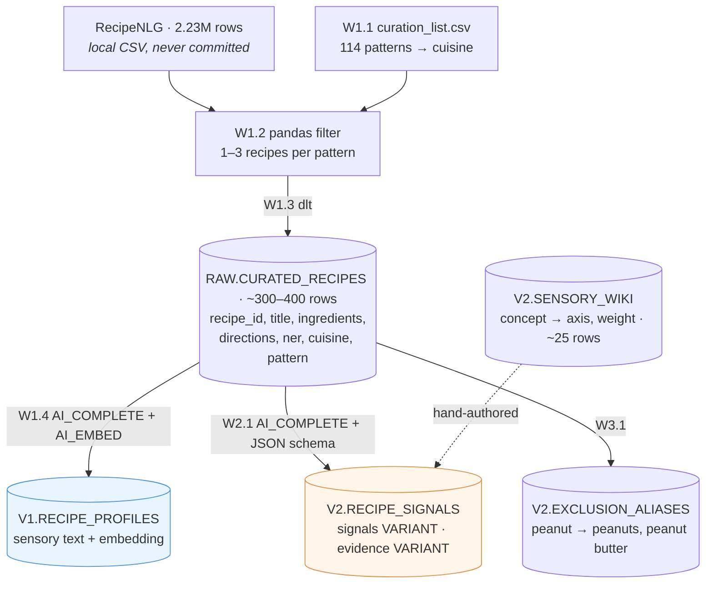
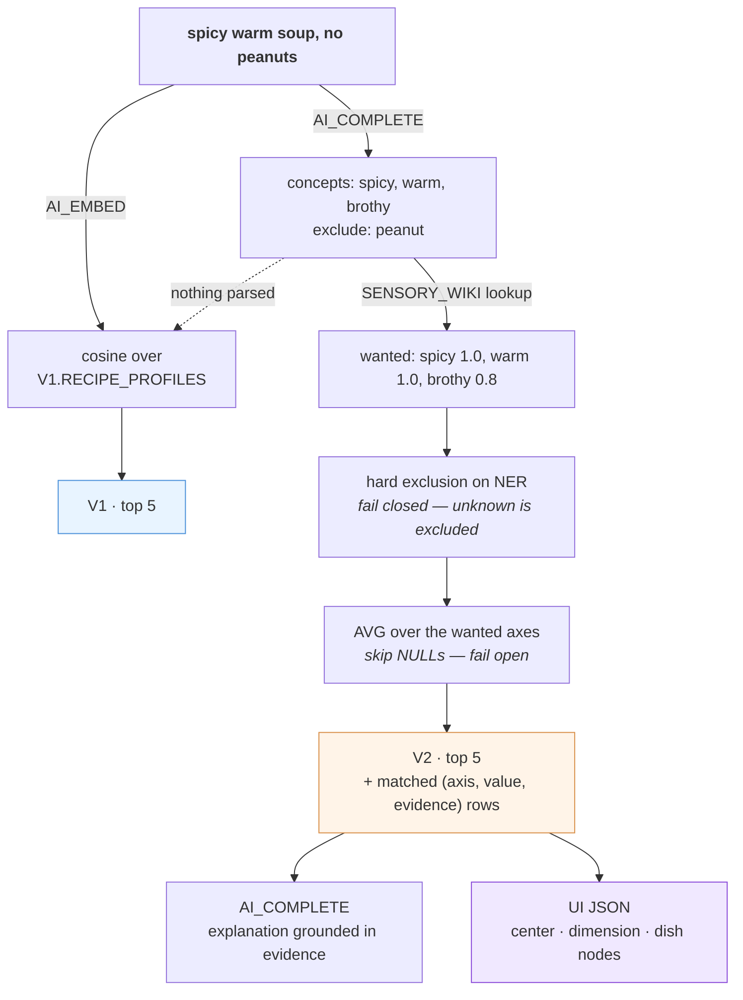

# V2 Plan

**One line:** a Snowflake-native recipe search that turns craving language into dish matches,
then shows *why* each dish matched as a constellation graph.

V1 findings that motivated the rebuild: [DESIGN.md](DESIGN.md) §7.
Judging rules (unchanged between V1 and V2): [eval/JUDGING.md](eval/JUDGING.md).

Working agreement: Siyeon writes the code. Weekends only. Every task states **what must be
true when it's done**, so a session can stop anywhere without losing the thread.

---

## The two systems

Keeping these straight is most of the project.

|  | V1 — baseline | V2 — proposed |
|---|---|---|
| Recipe becomes | one sensory **text** profile | structured **sensory signals** + evidence |
| Query becomes | an embedding | concepts → axes via the **sensory wiki**, + exclusions |
| Retrieval | vector similarity only | hard exclusion filter → attribute scoring |
| Exclusions | none (they silently fail) | ingredient match, fail closed |
| Fallback | — | vector search when nothing parses |

**The graph is the visualization layer, not the retrieval engine.** It renders what the
scoring already computed. A retrieval path that depended on the graph would return nothing
for any concept missing from it — v1's "squirts" failure, made total.

### The sensory wiki

A ~25-row table mapping craving concepts to weighted axes:

```csv
concept,axis,weight
refreshing,fresh,1.0
refreshing,warm,0.0
refreshing,rich,0.0
comforting,warm,1.0
comforting,rich,0.7
comforting,savory,0.6
hangover,warm,1.0
hangover,brothy,1.0
```

Its point is **not** the extra graph hop, though that is where the constellation UI gets its
depth. It is that without it, *nothing anywhere defines what "comforting" means*. The recipe
side would have one LLM call decide kimchi jjigae scores 0.9 on comforting, and the query
side a different call decide the user wants 1.0 — two independent interpretations of a word,
agreeing only by coincidence of sharing a name.

The wiki is that definition, in one file, hand-editable. When a result looks wrong, fix one
row and re-query. Without it the fix is a prompt change and a re-run over all 400 recipes.

Recipe-side axes stay exactly as they are — the wiki sits only on the query side. Decomposing
recipe axes into lower-level primitives (`cold`, `acidic`, `moisture`) is a later option, not
part of this build.

---

## Architecture

### Offline — build the corpus

Re-runs only when the data or the prompts change.



`V1.RECIPE_PROFILES` is the **baseline**. An axis in `V2.RECIPE_SIGNALS` is `NULL` whenever
its evidence is empty.

### Online — answer one craving



The matched rows feeding `T2` **are** the graph edges — the UI renders them and invents
nothing. The dotted line is the fallback: if nothing parses, V2 degrades to V1 behaviour,
because imperfect beats empty.

**Why `signals` is one `VARIANT` column, not one column per axis:** `AI_COMPLETE` already
returns JSON, so it goes in as-is — no parsing, no flattening. Adding an axis later is not a
migration. Query with `signals:spicy::float`.

---

## Scope

### Keep
English only · RecipeNLG curated subset · same embedding model as V1
(`arctic-embed-l-v2.0`) · Snowflake AI functions · ingredient exclusion · attribute scoring ·
constellation UI · **baseline-vs-V2 measurement**

### Dropped, and why

| Dropped | Why |
|---|---|
| Craving dictionary *with embeddings + nearest-neighbour lookup* | The lookup machinery is gone — `AI_COMPLETE` maps a phrasing to a concept directly. The ~25-row concept→axis mapping stays, as `V2.SENSORY_WIKI`: it is what defines the terms. |
| Dish-variant auto-splitting | Only a problem if recipes are merged by name. Keeping a row = a recipe, capped 1–3 per pattern, dissolves it — gungjung and gochugaru tteokbokki simply stay separate rows with their own signals. |
| `vegetarian` as an exclusion | Needs to know beef broth, gelatin, fish sauce aren't vegetarian. `almond`/`peanut` are string matches; this isn't. Clear line, stay on the easy side. |
| Cortex Search custom boosting | Not needed for scoring over ~400 rows. |
| Multilingual | Cross-lingual stays a cited v1 finding (measured 0.09 handicap), not a feature. |
| Complex reranking weights | `AVG` first. A hand-tuned `0.4×a + 0.25×b` is indefensible in an interview. |

### Constraints that must not be lost
- **RecipeNLG license is non-commercial research/educational.** Never commit the CSV or any
  extract (`data/*` is gitignored; `curation_list.csv` is the hand-authored exception).
  Credit Poznań University of Technology in the README.
- **Same embedding model in V1 and V2.** Change the architecture or the model, never both.
- **Exclusion is labelled a preference filter, not medical advice.** Fail-closed can't catch
  an allergen the ingredient list never names (marzipan, frangipane, amaretto).

---

## Weekend 1 — Baseline

⚠️ **This weekend builds V1 only.** The point is a number to beat. Any V2 work here leaves
nothing to compare against.

⚠️ **Do not improve the V1 prompt.** Reuse `sql/02_enrich.sql`'s terse noun-dense prompt
unchanged. It is the control arm. Ideas for improvement go in a notes file and get used in W2.

| # | Task | Done when |
|---|---|---|
| **W1.1** ✅ | `data/curation_list.csv` — 114 patterns | committed; every pattern matches ≥3 RecipeNLG titles |
| **W1.2** ✅ | pandas filter → `data/curated.csv`. `chunksize=100_000`; word boundaries (`pho` matches *phosphate*); cap 1–3 recipes per pattern | 300–400 rows, and `grep -ci` finds tteokbokki, pho, birria, marzipan |
| **W1.3** ✅ | dlt → `RAW.CURATED_RECIPES` | `SELECT COUNT(*)` equals the CSV row count |
| **W1.4** ✅ | V1 profiles + embeddings → `V1.RECIPE_PROFILES` | row count matches; 5 spot-checked profiles read like `"Tteokbokki. Spicy rice cake dish. Savory, fiery, sweet. Chewy, soft. Gochujang, rice cakes."` |
| **W1.5** ✅ | 12–15 English eval queries in `eval/queries.yml` | every category present, **including exclusion** (`"spicy dish without peanuts"`, `"comforting dish without almonds"`) |
| **W1.6** ✅ | Build the pool (`sql/05_eval.sql` ③④), judge **graded 0–3** per `JUDGING.md` | `EVAL.JUDGMENTS` loaded, ~50–70% non-zero. Much higher = bar too low to separate systems |
| **W1.7** ✅ | NDCG@5 + Recall@5, overall and per category → `eval/results_baseline.md` | numbers exist; **exclusion category recorded separately** — that's the one V2 must move |

Exclusion must be in the baseline *and expected to score badly*. V1 has no exclusion
mechanism at all — "no peanuts" is the negation failure already measured in v1. That failing
number is what makes V2's fix legible.

**→ Deliverable: the baseline number. DONE 2026-07-31 — NDCG@5 0.797 overall, exclusion 0.504 (q13 almonds 0.307, q12 peanuts 0.352). Full readout: [eval/results_baseline.md](eval/results_baseline.md).**

## Weekend 2 — Structured signals

Fix **6–8 axes** up front and don't grow them: `spicy, warm, brothy, savory, rich, fresh,
sweet, comforting`.

| # | Task | Done when |
|---|---|---|
| **W2.1** | `AI_COMPLETE` + `response_format` → `V2.RECIPE_SIGNALS` (`signals`, `evidence` VARIANT) | `SELECT COUNT(*) WHERE signals:spicy IS NOT NULL AND evidence:spicy IS NULL` returns **0** |
| **W2.2** | `V2.SENSORY_WIKI` — ~25 rows, hand-authored, one row per (concept, axis) | every axis a concept references exists in the fixed 6–8; `refreshing` and `comforting` both resolve |
| **W2.3** | Query parser prompt → `{"concepts": [...], "exclude": [...]}`, then wiki lookup → axis targets | `"spicy warm soup no peanuts"` parses; an unseen phrasing maps to a known concept rather than inventing an axis |
| **W2.4** | Spot-check ~20 recipes against dishes you actually know | kimchi jjigae / pho / birria signals are defensible; anything wrong is an *enrichment* note, not a retrieval one |

## Weekend 3 — V2 retrieval + the comparison

| # | Task | Done when |
|---|---|---|
| **W3.1** | `V2.EXCLUSION_ALIASES` + hard filter on `NER` | `"no peanuts"` removes every peanut dish **and** every dish whose peanut status is unknown |
| **W3.2** | Scoring SQL — AVG over wanted axes, skip NULLs — emitting matched rows as JSON | one query returns ranked dishes **and** their `(axis, value, evidence)` rows |
| **W3.3** | Re-judge the **same queries, same rules**, one sitting | `eval/results_v2.md` beside the baseline; exclusion has moved |

## Weekend 4 — Constellation UI + writeup

| # | Task | Done when |
|---|---|---|
| **W4.1** | UI from W3.2's JSON: center craving node → dimension nodes (colour per axis) → dish nodes (match %). **Static first.** | every edge traces to a backend row; nothing invented in the frontend |
| **W4.2** | Animation — particle flow along edges, glow by match strength, hover shows evidence (`spicy → gochugaru`) | stretch goal; skip if W4.1 ran long |
| **W4.3** | README results: baseline vs V2 table, per-category, 3–5 failure cases with diagnosis, credits spent | the informal "3/10 → 9/10" in the resume line replaced by measured numbers |

---

## Success criteria

- **Exclusion queries must beat baseline.** Designed-in; if it doesn't move, something is miswired.
- Multi-constraint sensory queries improve via structured matching — report honestly if not.
- Every number in the README traceable to a re-runnable query.

## Risks

| Risk | Mitigation |
|---|---|
| Weekend 1 drifts into V2 | W1 is V1-only, prompt frozen. V2 tables start W2. |
| Axis creep | 6–8 fixed, decided W2.1, not revisited. The wiki grows instead — new craving concepts map onto existing axes. |
| UI eats the schedule | Static graph is the deliverable; animation is W4.2, droppable. |
| Judging drift | Same queries, same `JUDGING.md`, each round judged in one sitting. |

## Weekend 5+ (stretch) — scale-up

Only after the 400-row comparison is measured. Re-run the same pipeline at 30–50k rows and
**measure what breaks**: duplicate flooding, hub re-emergence, NDCG drift, and credits per
1k recipes. This is where "why Snowflake" stops being an argument and becomes a number.
Full 2.23M is embedding-only territory — signals enrichment scales linearly (~2.7B tokens
for the full set) and does not fit a trial.

## Open

- Whether the wiki should also carry *negative* weights (`refreshing → rich 0.0` is
  currently "want low", not "penalise high") or whether AVG-toward-target covers it.

- Whether `AVG` over wanted axes is enough, or axes the query stated explicitly need weight.
- What to show when exclusion empties the result set — "no safe matches" beats a bad match.
