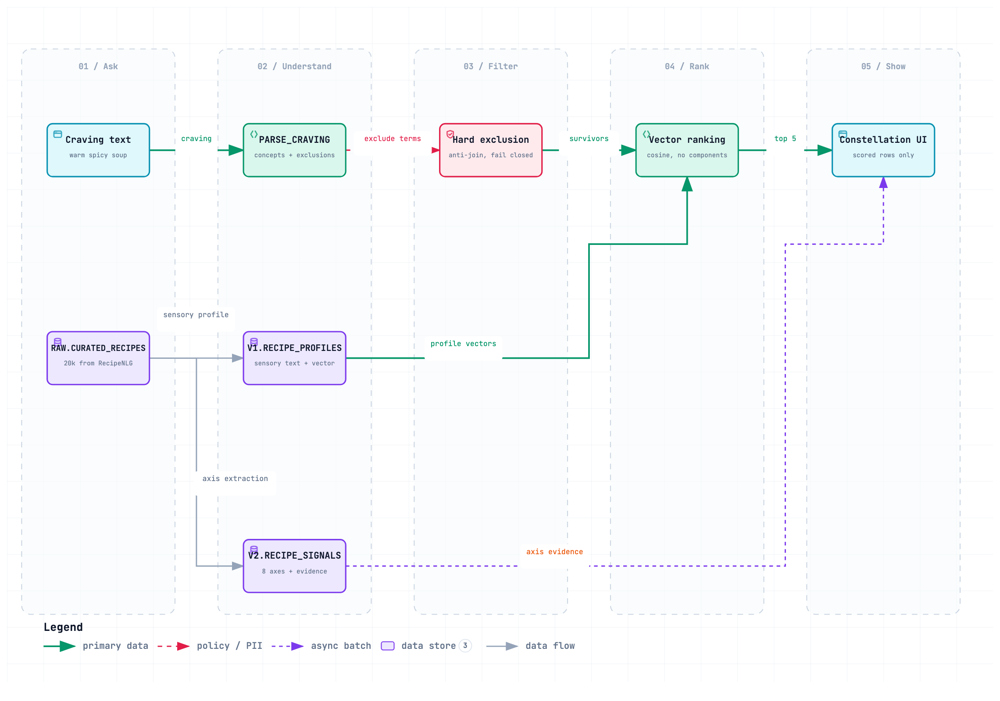

# CravingRAG

**Describe a craving in plain language. Get real dishes back — with the evidence for why.**

> *"warm spicy soup, no shellfish"* → the sky of 20,000 recipes narrows to five, and every
> match shows the exact ingredient lines that earned it.

CravingRAG **structures an unstructured recipe catalog once, so that consumer search and
business analysis use the same data product.** Built Snowflake-native: Cortex reads each
recipe where it lives and writes eight sensory axes plus the ingredient line that proves
each one, as ordinary columns. One extraction, one table, two customers.

```
                    Sensory data model
        (Cortex-extracted axes + evidence, per recipe)
                           │
            ┌──────────────┴──────────────┐
            ▼                             ▼
     Consumer experience            Business intelligence
   "what should I eat?"          "what do people ask for that
   constellation UI, live          we do not offer enough of?"
   ranked, explained,             semantic view, Cortex Analyst,
   allergen fails closed          demand-supply mart, menu decision
```

It did not start as a data product. It started as a **retrieval study with an explanation
layer**, from a question left over from a previous project (PantryAI): an LLM can
*generate* a recipe that satisfies every requested ingredient and still feel implausible,
so instead of asking AI to invent food, can we *retrieve* real recipes that match what
someone feels like eating? Answering that honestly meant measuring how representation,
query semantics, and constraints fail in semantic retrieval, and building controlled fixes.
The measurement below is that study. It worked, but a search box that returns five dishes
is a feature, and a feature does not need a warehouse. The reason for Snowflake only showed
up when the same extracted axes were read the other way round, as "which cravings does this
catalog fail to serve": nothing was re-extracted, the columns written for search already
were the analytics ([sql/13](sql/13_catalog_insights.sql) to
[sql/16](sql/16_demand_supply_mart.sql)).

Project history, including the 2026-08 adversarial-review hardening pass:
[PROGRESS.md](PROGRESS.md).

## The result (measured, not claimed)

Four retrieval arms, one blinded human-judged pool (386 judgments over the union of every
arm's top-10; one ideal ranking per query shared by all arms). 15 frozen queries,
342-recipe curated corpus. Full readout: [eval/results_v2.md](eval/results_v2.md).

| arm | NDCG@5 | P@5 |
|---|---:|---:|
| raw recipe text → embedding (control) | 0.582 | 0.560 |
| structured 8-axis scoring | 0.698 | 0.747 |
| LLM sensory profile → embedding | 0.732 | 0.773 |
| **profile embedding + hard exclusion** | **0.844** | **0.880** |

Each gap measures one thing:

- **Enrichment works** (+0.150): raw text ranks by word overlap — five almond desserts for
  *"without almonds"*. Rewriting recipes into sensory profiles before embedding is the
  project's original claim, finally measured against a control.
- **Hard exclusion is the biggest lever** (+0.112 overall; exclusion-query NDCG 0.245 →
  0.855): embeddings cannot subtract, an anti-join can. Caveat, measured: with only 15
  queries the paired bootstrap CI on this delta crosses zero ([-0.009, +0.271], see
  `eval/confidence.py`); the enrichment gap is significant, this one needs more queries.
- **Structured axis scoring loses the ranking war and wins its real jobs.** It collapses
  when a query's key noun has no axis (*"savory NOODLE soup"* 0.07 — the axes express
  intensity, not identity), but it powers the exclusion's evidence and the entire
  explanation layer. *Precision from structure, coverage from embeddings* — with numbers.

The judging produced its own findings — including the machine auditing the human (7 human
grades violated their query's exclusion and were overridden to 0 with provenance), and a
`"finely chopped nuts"` baklava judged 0 for *"without almonds"* because unverifiable
absence fails closed. See [eval/results_v2.md](eval/results_v2.md) §Findings.

## Scale

The measured pipeline then ran at scale, meter-first: a 1k batch read **$4.55** from
`ACCOUNT_USAGE`, the projection cleared the budget gate, and **20,000 recipes were enriched
in 21 minutes for ~$90** (profiles + embeddings + signals; the evidence-or-NULL contract
held with 0 violations). Scale immediately taught two things: noodle-soup queries fixed
themselves (embedding coverage grows with corpus size), and a new failure class appeared
(beverages flooding "refreshing" — the curated 342 had no drinks; a random 19.7k does).
Details in [PLAN.md](PLAN.md) §Weekend 5+.

**Scope of the numbers:** every metric above was judged on the 342-recipe dev corpus. The
20k live corpus has not been re-judged, and the beverage failure above is direct evidence
the scores don't transfer unchanged — treat 0.844 as a dev-corpus result, not a live one.

## Consumer side — the constellation

```bash
.venv/bin/python ui/server.py    # → http://localhost:8642
```

Every dish is a star. Type a craving: the live pipeline parses it (Cortex call), maps
concepts to axes through the hand-editable sensory wiki, then the hard-exclusion pass kills
matching stars in red — each flashing the term that caught it — and the five survivors form
a constellation with verbatim evidence in the side card (*spicy 0.8 ← "10 Thai chile
peppers, seeded and minced"*). Ranking uses the measured winner (profile vectors +
exclusion); the axes explain. The UI renders scored rows and invents nothing.

The UI is the React app in `ui/app` (served built by `server.py`; `npm run dev` in
`ui/app` for the Vite dev server), two pages: **Search** and **About** (what the project
does, the pipeline diagram from `docs/diagrams/`, process done, measured results). Motion is
GSAP, kept quiet. Earlier skies live in `archive/`.

## Business side — the same axes as dimensions

The extraction that powers search is also a semantic layer
([sql/14_semantic_view.sql](sql/14_semantic_view.sql)): a Snowflake **semantic view** over
the axis columns, with synonyms and metrics, so **Cortex Analyst** turns a product
question into SQL nobody writes:

> *"How many dishes satisfy fresh + spicy?"* → **240 of 19,260 (1.25%)** — while warm/savory
> comfort food is half the catalog. The underserved-combination finding is one
> natural-language question away.

More catalog findings (all real data):
[sql/13_catalog_insights.sql](sql/13_catalog_insights.sql) — the catalog skews hard to
comfort food (warm 70%, spicy 6%), and a dairy-free customer loses **63%** of it.

**Demand → supply → decision.** Supply alone cannot say whether 240 is too few. There is
no real search traffic in this project, so demand is declared, not observed: three
scenarios with every assumption in one file ([data/demand_scenarios.yml](data/demand_scenarios.yml)),
a seeded generator ([pipelines/generate_demo_demand.py](pipelines/generate_demo_demand.py),
3,000 events, 49 phrasings, each parsed once by the real parser) writing to
`ANALYTICS.SEARCH_EVENTS` ([sql/15](sql/15_demand_events.sql)) with `source =
'synthetic_demo'` on every row, and a mart ([sql/16](sql/16_demand_supply_mart.sql)):

```sql
SELECT * FROM ANALYTICS.DEMAND_SUPPLY_GAPS ORDER BY opportunity_index DESC;
-- phoenix_summer / fresh_spicy: 42.7% of demand vs 1.25% of catalog → 34× under-supplied
```

`opportunity_index = demand_share / supply_share`. The **Catalog** page in the UI renders
that table; a second semantic view (`ANALYTICS.DEMAND_SUPPLY`) exposes it to Cortex
Analyst. Real `/search` calls are recorded as `source = 'live_demo'` and kept out of the
ratios. The generator records what it *meant* (`authored_intent`) separately from what the
parser *understood* (`parsed_axes`); their disagreement is a free parser-quality measurement
(the parser reads "hot dish" as temperature).

## Decision provenance (optional notebook)

Every `/search` writes one decision record: query, parsed preferences, exclusion needles,
how many candidates were looked at, which were rejected and why (`excluded:cream`,
`component`, `duplicate_title`), the five picked with their evidence, and a `causes` link
to the architecture decision that put the exclusion filter there. Architecture decisions
themselves are records too (`provenance/architecture.py`: eval result → finding →
decision → V2), so one trace runs from a served dish back to the measurement.

The app talks to a `DecisionRecorder` interface (`provenance/recorder.py`), never to a
vendor. `CRAVING_DECISIONS` picks the notebook: `jsonl` (default, stdlib,
`data/decisions.jsonl`), `off`, or `semantica`. Recording failures are logged, never
surfaced: a broken notebook cannot break a search.

```bash
.venv/bin/python -m provenance.architecture          # record the V1→V2 chain once
.venv/bin/python -m provenance.recorder list          # everything recorded
.venv/bin/python -m provenance.recorder trace <id>    # walk causes back to the root
.venv/bin/pytest provenance -v
```

**Why Semantica is an adapter, not the default.** It was evaluated for exactly this
layer (decision records + causal links, `semantica.context.ContextGraph`). Its API fits
the record shape, but `pip install semantica` pulls torch, transformers, spaCy, OpenCV
and more (1.8 GB measured), imports in ~40 s, and in 0.6.6 its own
`trace_decision_chain` does not survive a save/load cycle. The two things this project
needs from a provenance store, append a record and walk `causes`, are stdlib work. So
Semantica stays behind the flag for experiments (`pip install semantica` in a separate
venv, `CRAVING_DECISIONS=semantica`), and retrieval stays entirely in Snowflake.

## Honest limits (deliberately deferred, tracked in [PLAN.md](PLAN.md) §v3)

Single annotator (test-retest κw 0.624 on 29 re-judged pairs); 15 dev-set queries written
with answers in mind — an acceptance suite, not a neutral benchmark; V1→V2 is not a full
ablation (the raw-text control and exclusion on/off are); eval numbers are 342-corpus
measurements, not yet re-judged at 20k. An LLM judge (llama, different family than the
enricher) was designed, validated against human grades, and **rejected** — not for its
agreement number but for the direction of its errors (systematic over-exclusion).

## Architecture

[](docs/diagrams/craving-pipeline.html)

*Interactive version: open [`docs/diagrams/craving-pipeline.html`](docs/diagrams/craving-pipeline.html) locally (archify; source in `craving-pipeline.dataflow.json`).*

## Stack

Python (`dlt`, `pandas`, stdlib HTTP server) · Snowflake (`AI_COMPLETE`, `AI_EMBED`,
`VECTOR`, VARIANT, semantic views, Cortex Analyst) · evaluation: frozen queries, pooled
blinded judgments, NDCG@5 / P@5 / pooled recall. No external LLM API, no separate vector DB.

## Data, credits, and licenses

**Data.** The corpus derives from **RecipeNLG** (Poznań University of Technology), licensed
for non-commercial research/educational use. The source CSV and all generated extracts stay
local (`data/*` gitignored except the hand-authored `data/curation_list.csv` and
`data/demand_scenarios.yml`). Search demand in `ANALYTICS.SEARCH_EVENTS` is synthetic,
generated from that yml, and labeled `source = 'synthetic_demo'` on every row.

**Third-party code and tools this project uses.** All code written here is by Siyeon Park;
the pieces below are other people's work, used under their licenses.

| what | used for | author | license |
|---|---|---|---|
| [GSAP](https://gsap.com) 3.15 + `@gsap/react` | page transitions, constellation and results motion (`ui/app`) | GreenSock / Webflow | [GSAP Standard License](https://gsap.com/standard-license) (no charge) |
| [gsap-skills](https://github.com/greensock/gsap-skills) | agent guidance while writing the GSAP code above | GreenSock | MIT |
| [archify](https://github.com/tt-a1i/archify) 2.16 | the pipeline diagram (`docs/diagrams/craving-pipeline.html`, rendered from `.dataflow.json`) | tt-a1i, based on Cocoon AI's architecture-diagram-generator | MIT |
| [Semantica](https://github.com/semantica-agi/semantica) | optional decision-graph backend behind `CRAVING_DECISIONS=semantica` (see Decision provenance) | semantica-agi | MIT |
| React, Vite | UI build | Meta, Evan You and contributors | MIT |
| `dlt`, `snowflake-connector-python`, `pandas`, PyYAML | loading, Snowflake access, data handling | respective authors | Apache-2.0 / BSD / MIT |
| Snowflake Cortex (`AI_COMPLETE`, `AI_EMBED`, Cortex Analyst) | enrichment, embeddings, semantic layer | Snowflake | Snowflake terms of service |
| [Google Flow](https://labs.google/flow) (Veo) | the three background videos + posters under `ui/app/public/media`, generated for this project | Google | generated output, used under [Google's Gemini/Flow terms](https://policies.google.com/terms/generative-ai) |

Background footage under `ui/app/public/media` (three mp4 + posters) is AI-generated with
Google Flow (Veo) for this project; used under Google's generative-AI terms.

**This repository's own license.** The source code is [MIT](LICENSE). The license covers
the authored code only — the RecipeNLG-derived data stays non-commercial research/educational
regardless, and the generated media and third-party dependencies above keep their own terms.

## Setup

```bash
python -m venv .venv && source .venv/bin/activate
pip install -r requirements.txt -r requirements-dev.txt
cp .dlt/example.secrets.toml .dlt/secrets.toml   # key-pair auth; see comments inside
```

Pipeline order: `pipelines/curate.py` → `pipelines/load_curated.py` →
`sql/06`–`08` (enrichment) → `pipelines/compile_wiki.py` → `sql/09` (parser) →
`pipelines/load_frozen_parses.py` (⚠️ before 10–12: they read `EVAL2.V2_PARSED`) →
`sql/10`–`12` (exclusion, scoring, pooled eval) → `sql/13`–`14` (insights,
semantic view) → `sql/15` → `pipelines/generate_demo_demand.py` → `sql/16` (demand
events, synthetic demand, demand-supply mart; rerun `sql/14` ④ after) → `ui/server.py`. Scale-up: `pipelines/scale_corpus.py` (meter-first — read
PLAN.md §Weekend 5+ before spending).

## Checks

```bash
python -m pytest pipelines -v          # wiki compiler tests
python pipelines/compile_wiki.py --check
```

## Repo layout

```text
sql/      01 setup · 06-07 V1 baseline + eval · 08 signals · 09 parser (frozen)
          10 exclusion view · 11 V2 scoring · 12 pooled 4-arm eval
          13 catalog insights · 14 semantic view
pipelines/ curate · load_curated · scale_corpus · compile_wiki · load_frozen_parses
wiki/     craving concepts, axis weights in frontmatter (Obsidian vault)
eval/     queries.yml · JUDGING.md · judgments.csv (386, with provenance)
          parses_frozen.csv · results_baseline.md · results_v2.md
          confidence.py (bootstrap CIs) · make_pool_20k.py (blinded live-corpus pool)
ui/       server.py (live pipeline API) · app/ (React constellation)
provenance/ recorder (interface, jsonl, semantica) · recommendation · architecture · tests
archive/  superseded: DESIGN.md, V1 search, first loaders, earlier UIs
```
