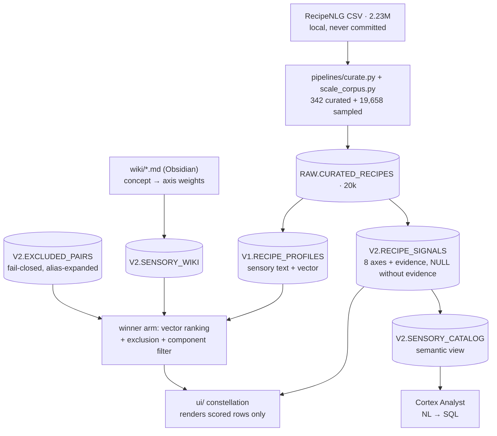

# CravingRAG

**Describe a craving in plain language. Get real dishes back — with the evidence for why.**

> *"warm spicy soup, no shellfish"* → the sky of 20,000 recipes narrows to five, and every
> match shows the exact ingredient lines that earned it.

CravingRAG is a **retrieval study with an explanation layer**, built Snowflake-native. It
started with a question left over from a previous project (PantryAI): an LLM can *generate*
a recipe that satisfies every requested ingredient and still feel implausible — so instead
of asking AI to invent food, can we *retrieve* real recipes that match what someone feels
like eating? Answering that honestly turned out to mean measuring how representation, query
semantics, and constraints fail in semantic retrieval — and building controlled fixes.

One sensory data model feeds two experiences:

```
                    Sensory data model
        (Cortex-extracted axes + evidence, per recipe)
                           │
            ┌──────────────┴──────────────┐
            ▼                             ▼
     Consumer experience            Business intelligence
   "what should I eat?"          "what does our catalog offer?"
   constellation UI, live         semantic view + Cortex Analyst
```

## The result (measured, not claimed)

Four retrieval arms, one blinded human-judged pool (386 judgments over the union of every
arm's top-10; one ideal ranking per query shared by all arms). 15 frozen queries,
342-recipe curated corpus. Full readout: [eval/results_v2.md](eval/results_v2.md).

| arm | NDCG@5 | P@5 |
|---|---:|---:|
| raw recipe text → embedding (control) | 0.582 | 0.560 |
| structured 8-axis scoring | 0.698 | 0.747 |
| LLM sensory profile → embedding | 0.732 | 0.773 |
| **profile embedding + hard exclusion** | **0.844** | **0.880** |

Each gap measures one thing:

- **Enrichment works** (+0.150): raw text ranks by word overlap — five almond desserts for
  *"without almonds"*. Rewriting recipes into sensory profiles before embedding is the
  project's original claim, finally measured against a control.
- **Hard exclusion is the biggest lever** (+0.112 overall; exclusion-query NDCG 0.245 →
  0.855): embeddings cannot subtract, an anti-join can.
- **Structured axis scoring loses the ranking war and wins its real jobs.** It collapses
  when a query's key noun has no axis (*"savory NOODLE soup"* 0.07 — the axes express
  intensity, not identity), but it powers the exclusion's evidence and the entire
  explanation layer. *Precision from structure, coverage from embeddings* — with numbers.

The judging produced its own findings — including the machine auditing the human (7 human
grades violated their query's exclusion and were overridden to 0 with provenance), and a
`"finely chopped nuts"` baklava judged 0 for *"without almonds"* because unverifiable
absence fails closed. See [eval/results_v2.md](eval/results_v2.md) §Findings.

## Scale

The measured pipeline then ran at scale, meter-first: a 1k batch read **$4.55** from
`ACCOUNT_USAGE`, the projection cleared the budget gate, and **20,000 recipes were enriched
in 21 minutes for ~$90** (profiles + embeddings + signals; the evidence-or-NULL contract
held with 0 violations). Scale immediately taught two things: noodle-soup queries fixed
themselves (embedding coverage grows with corpus size), and a new failure class appeared
(beverages flooding "refreshing" — the curated 342 had no drinks; a random 19.7k does).
Details in [PLAN.md](PLAN.md) §Weekend 5+.

## Consumer side — the constellation

```bash
.venv/bin/python ui/server.py    # → http://localhost:8642
```

Every dish is a star. Type a craving: the live pipeline parses it (Cortex call), maps
concepts to axes through the hand-editable sensory wiki, then the hard-exclusion pass kills
matching stars in red — each flashing the term that caught it — and the five survivors form
a constellation with verbatim evidence in the side card (*spicy 0.8 ← "10 Thai chile
peppers, seeded and minced"*). Ranking uses the measured winner (profile vectors +
exclusion); the axes explain. The UI renders scored rows and invents nothing.

`ui/constellation_static.html` is the offline fallback (the 15 eval queries, no server).

## Business side — the same axes as dimensions

The extraction that powers search is also a semantic layer
([sql/14_semantic_view.sql](sql/14_semantic_view.sql)): a Snowflake **semantic view** over
the axis columns, with synonyms and metrics, so **Cortex Analyst** turns a product
question into SQL nobody writes:

> *"How many dishes satisfy fresh + spicy?"* → **230 of 19,260 (1.2%)** — while warm/savory
> comfort food is half the catalog. The underserved-combination finding is one
> natural-language question away.

More catalog findings (all real data, no behavioral data invented):
[sql/13_catalog_insights.sql](sql/13_catalog_insights.sql) — the catalog skews hard to
comfort food (warm 70%, spicy 6%), and a dairy-free customer loses **63%** of it.

## Honest limits (deliberately deferred, tracked in [PLAN.md](PLAN.md) §v3)

Single annotator (test-retest κw 0.624 on 29 re-judged pairs); 15 dev-set queries written
with answers in mind — an acceptance suite, not a neutral benchmark; V1→V2 is not a full
ablation (the raw-text control and exclusion on/off are); eval numbers are 342-corpus
measurements, not yet re-judged at 20k. An LLM judge (llama, different family than the
enricher) was designed, validated against human grades, and **rejected** — not for its
agreement number but for the direction of its errors (systematic over-exclusion).

## Architecture



## Stack

Python (`dlt`, `pandas`, stdlib HTTP server) · Snowflake (`AI_COMPLETE`, `AI_EMBED`,
`VECTOR`, VARIANT, semantic views, Cortex Analyst) · evaluation: frozen queries, pooled
blinded judgments, NDCG@5 / P@5 / pooled recall. No external LLM API, no separate vector DB.

## Data and license

The corpus derives from **RecipeNLG** (Poznań University of Technology) — non-commercial
research/educational use. The source CSV and all generated extracts stay local
(`data/*` gitignored except the hand-authored `data/curation_list.csv`).

## Setup

```bash
python -m venv .venv && source .venv/bin/activate
pip install -r requirements.txt -r requirements-dev.txt
cp .dlt/example.secrets.toml .dlt/secrets.toml   # key-pair auth; see comments inside
```

Pipeline order: `pipelines/curate.py` → `pipelines/load_curated.py` →
`sql/06`–`08` (enrichment) → `pipelines/compile_wiki.py` → `sql/09`–`12` (parser, exclusion,
scoring, pooled eval) → `pipelines/load_frozen_parses.py` → `sql/13`–`14` (insights,
semantic view) → `ui/server.py`. Scale-up: `pipelines/scale_corpus.py` (meter-first — read
PLAN.md §Weekend 5+ before spending).

## Checks

```bash
python -m pytest pipelines -v          # wiki compiler tests
python pipelines/compile_wiki.py --check
```

## Repo layout

```text
sql/      01 setup · 06-07 V1 baseline + eval · 08 signals · 09 parser (frozen)
          10 exclusion view · 11 V2 scoring · 12 pooled 4-arm eval
          13 catalog insights · 14 semantic view
pipelines/ curate · load_curated · scale_corpus · compile_wiki · load_frozen_parses
wiki/     craving concepts, axis weights in frontmatter (Obsidian vault)
eval/     queries.yml · JUDGING.md · judgments.csv (386, with provenance)
          parses_frozen.csv · results_baseline.md · results_v2.md
ui/       server.py (live) · live.html (constellation) · constellation_static.html (fallback)
```
