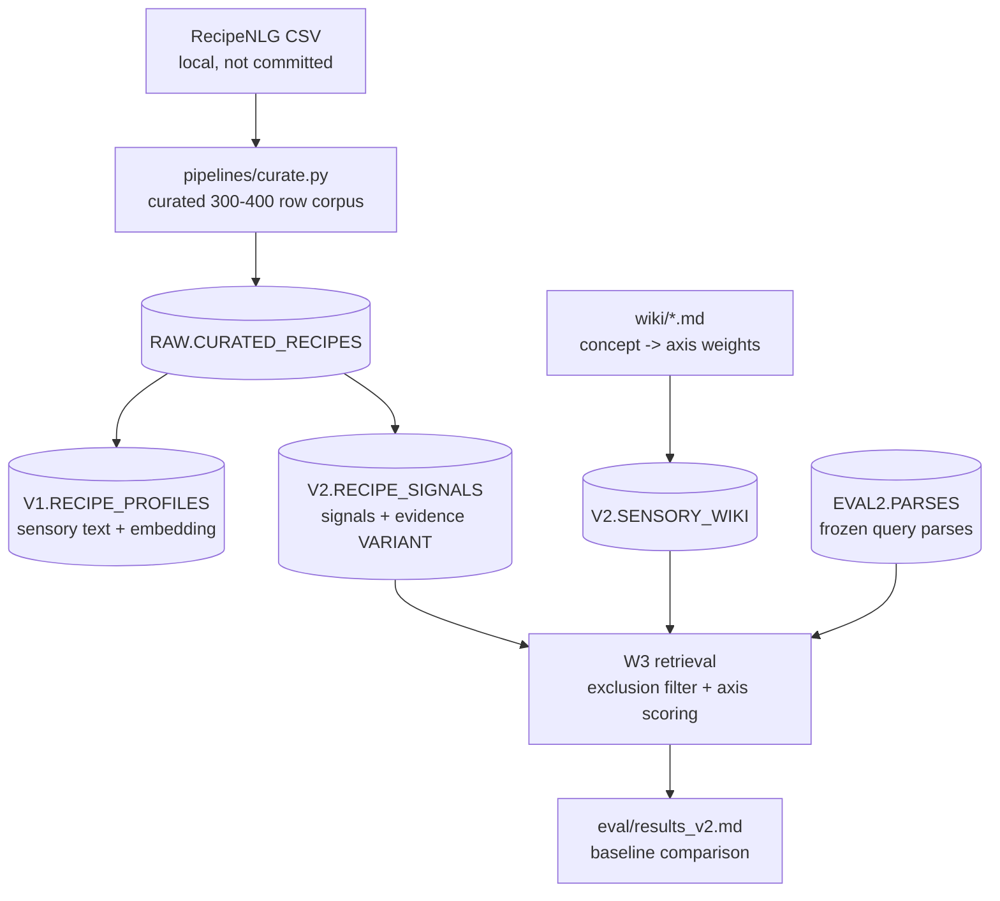

# CravingRAG

**Describe a craving in plain language. Get real recipes back, with reasons.**

> "something refreshing and juicy" -> dishes that match the sensory intent, not just a
> keyword.

CravingRAG is a Snowflake-native RAG project for recipe search. The project exists to test a
specific retrieval idea: food cravings are usually sensory or situational, so recipe search
gets better when recipes are rewritten into retrievable sensory representations before they
are embedded.

## Current Status

**V2 rebuild in progress.** The baseline is complete and measured; the current work is the
structured-signals retriever described in [PLAN.md](PLAN.md).

| Milestone | Status | Evidence |
|---|---:|---|
| Curated RecipeNLG corpus | Done | `data/curation_list.csv` -> local `data/curated.csv` |
| V1 enriched-vector baseline | Done | `sql/06_v1_baseline.sql` |
| Baseline evaluation | Done | [eval/results_baseline.md](eval/results_baseline.md) |
| V2 structured recipe signals | In progress | `sql/08_v2_signals.sql` |
| V2 query parser + sensory wiki | In progress | `sql/09_query_parser.sql`, `wiki/`, `pipelines/compile_wiki.py` |
| V2 retrieval + comparison | Next | W3 in [PLAN.md](PLAN.md) |
| Constellation UI | Later | W4 in [PLAN.md](PLAN.md) |

Baseline result, frozen on 2026-07-31:

| Arm | NDCG@5 | Recall@5 |
|---|---:|---:|
| V1 enriched vector | 0.797 | 0.843 |

The important baseline weakness is exclusion: **NDCG@5 = 0.504** for queries like
`spicy dish without peanuts`. V2 is designed to move that number with hard ingredient
exclusion plus structured sensory scoring.

## What Changed From V1 To V2

V1 embeds one generated text profile per recipe:

```text
recipe -> sensory text profile -> AI_EMBED -> cosine search
```

V2 keeps the V1 baseline, then adds structured signals:

```text
recipe -> {spicy, warm, brothy, ...} + evidence
query  -> concepts + exclusions -> sensory wiki -> target axes
       -> hard exclusion filter -> attribute scoring
```

The sensory wiki is the project’s small hand-editable definition layer. It maps craving
concepts such as `refreshing`, `cozy`, and `indulgent` onto fixed axes such as `fresh`,
`warm`, `rich`, and `comforting`. This keeps the meaning of a craving in one place instead
of burying it in a prompt.

Read [DESIGN.md](DESIGN.md) for the original retrieval rationale and [DECISIONS.md](DECISIONS.md)
for the V2 data-model tradeoffs.

## Architecture



## Stack

- Python: `dlt`, `pandas`
- Snowflake: warehouses, schemas, `VECTOR`, `AI_EMBED`, `AI_COMPLETE`
- Evaluation: frozen query set, pooled judgments, NDCG@5, Recall@5
- Planned UI: Streamlit constellation graph

No external LLM API key or separate vector database is required.

## Data And License Notes

The V2 corpus is curated from RecipeNLG. RecipeNLG is for non-commercial research and
educational use; do not commit the source CSV or generated extracts. This repo commits only
the hand-authored curation list and evaluation metadata.

Credit: RecipeNLG dataset by Poznan University of Technology researchers. Follow the
RecipeNLG license and citation requirements when sharing results.

The `.gitignore` intentionally excludes `data/*` except `data/curation_list.csv`.

## Setup

### 1. Python environment

```bash
python -m venv .venv
source .venv/bin/activate
pip install -r requirements.txt
pip install -r requirements-dev.txt
```

### 2. Snowflake connection

Run SQL in Snowsight using `CRAVING_WH`. Local Python scripts use dlt credentials:

```bash
cp .dlt/example.secrets.toml .dlt/secrets.toml
```

Use key-pair auth for programmatic Snowflake access. Password auth commonly fails because
Snowflake enforces MFA for programmatic connections. The example secrets file includes the
key-pair setup commands.

Never commit `.dlt/secrets.toml`, private keys, or generated RecipeNLG extracts.

## Running The Current Pipeline

### Baseline, already completed

```bash
python pipelines/curate.py --source ~/Downloads/archive/RecipeNLG_dataset.csv
python pipelines/load_curated.py
```

Then run these in Snowsight:

```text
sql/01_setup.sql
sql/06_v1_baseline.sql
sql/07_eval_baseline.sql
```

The saved baseline readout is [eval/results_baseline.md](eval/results_baseline.md).

### V2, current path

```bash
python pipelines/compile_wiki.py --check
python pipelines/compile_wiki.py
```

Then run in Snowsight:

```text
sql/08_v2_signals.sql
sql/09_query_parser.sql
```

Next planned file: V2 retrieval/scoring SQL for W3.

## Local Checks

```bash
python pipelines/compile_wiki.py --check
python -m compileall pipelines
python -m pytest pipelines -v
```

If `pytest` crashes before collecting tests, check that you are using the project venv rather
than a global Python distribution.

## Repo Layout

```text
sql/
  01_setup.sql          account setup and Cortex checks
  06_v1_baseline.sql    frozen V1 baseline profiles + embeddings
  07_eval_baseline.sql  baseline evaluation
  08_v2_signals.sql     structured recipe signals
  09_query_parser.sql   query parsing + frozen parses
pipelines/
  curate.py             RecipeNLG -> curated local CSV
  load_curated.py       curated CSV -> Snowflake
  compile_wiki.py       wiki frontmatter -> V2.SENSORY_WIKI
wiki/
  *.md                  human-readable craving concepts + axis weights
eval/
  queries.yml           frozen evaluation queries
  judgments_baseline.csv
  parses_frozen.csv
  results_baseline.md
archive/
  retired V1 files
```
