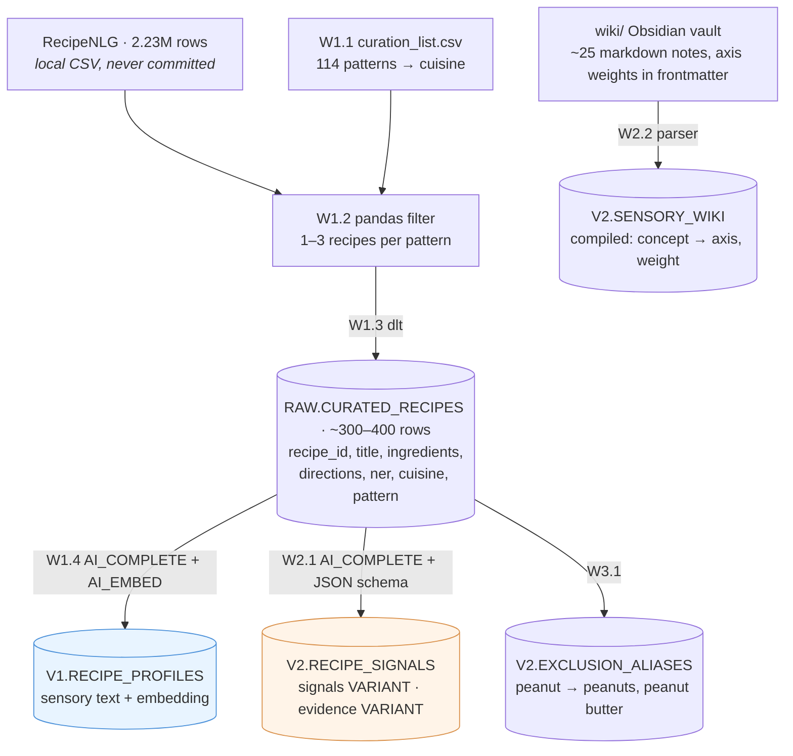
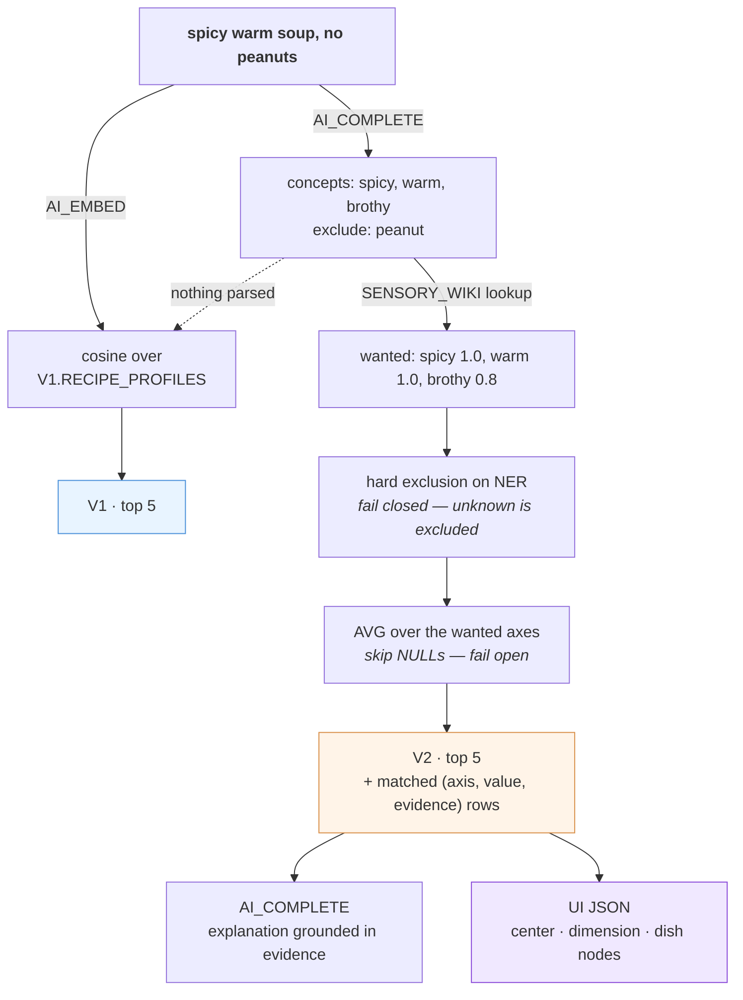

# V2 Plan

**One line:** a Snowflake-native recipe search that turns craving language into dish matches,
then shows *why* each dish matched as a constellation graph.

**Why it exists:** PantryAI (a previous project) generated recipes with an LLM — and taught
its author that a model can satisfy every requested ingredient while still producing
combinations that feel implausible. That raised the real question: instead of asking AI to
*invent* a recipe, could you *retrieve* a real one that matches what someone feels like
eating? The same failure resurfaced inside this project — v1's LLM wrote plausible-but-wrong
flavor profiles (jjinppang described as "earthy") — which is why V2 requires evidence for
every claim and stores NULL for anything it cannot ground. The evidence field is the
anti-hallucination mechanism this project's origin demanded.

V1 findings that motivated the rebuild: [DESIGN.md](DESIGN.md) §7.
Judging rules (unchanged between V1 and V2): [eval/JUDGING.md](../eval/JUDGING.md).

Working agreement: Siyeon writes the code. Weekends only. Every task states **what must be
true when it's done**, so a session can stop anywhere without losing the thread.

---

## The two systems

Keeping these straight is most of the project.

|  | V1 — baseline | V2 — proposed |
|---|---|---|
| Recipe becomes | one sensory **text** profile | structured **sensory signals** + evidence |
| Query becomes | an embedding | concepts → axes via the **sensory wiki**, + exclusions |
| Retrieval | vector similarity only | hard exclusion filter → attribute scoring |
| Exclusions | none (they silently fail) | ingredient match, fail closed |
| Fallback | — | vector search when nothing parses |

**The graph is the visualization layer, not the retrieval engine.** It renders what the
scoring already computed. A retrieval path that depended on the graph would return nothing
for any concept missing from it — v1's "squirts" failure, made total.

### The sensory wiki

A ~25-row table mapping craving concepts to weighted axes:

```csv
concept,axis,weight
refreshing,fresh,1.0
refreshing,warm,0.0
refreshing,rich,0.0
comforting,warm,1.0
comforting,rich,0.7
comforting,savory,0.6
hangover,warm,1.0
hangover,brothy,1.0
```

Its point is **not** the extra graph hop, though that is where the constellation UI gets its
depth. It is that without it, *nothing anywhere defines what "comforting" means*. The recipe
side would have one LLM call decide kimchi jjigae scores 0.9 on comforting, and the query
side a different call decide the user wants 1.0 — two independent interpretations of a word,
agreeing only by coincidence of sharing a name.

The wiki is that definition, in one file, hand-editable. When a result looks wrong, fix one
row and re-query. Without it the fix is a prompt change and a re-run over all 400 recipes.

Recipe-side axes stay exactly as they are — the wiki sits only on the query side. Decomposing
recipe axes into lower-level primitives (`cold`, `acidic`, `moisture`) is a later option, not
part of this build.

---

## Architecture

### Offline — build the corpus

Re-runs only when the data or the prompts change.



`V1.RECIPE_PROFILES` is the **baseline**. An axis in `V2.RECIPE_SIGNALS` is `NULL` whenever
its evidence is empty.

### Online — answer one craving



The matched rows feeding `T2` **are** the graph edges — the UI renders them and invents
nothing. The dotted line is the fallback: if nothing parses, V2 degrades to V1 behaviour,
because imperfect beats empty.

**Why `signals` is one `VARIANT` column, not one column per axis:** `AI_COMPLETE` already
returns JSON, so it goes in as-is — no parsing, no flattening. Adding an axis later is not a
migration. Query with `signals:spicy::float`.

---

## Scope

### Keep
English only · RecipeNLG curated subset · same embedding model as V1
(`arctic-embed-l-v2.0`) · Snowflake AI functions · ingredient exclusion · attribute scoring ·
constellation UI · **baseline-vs-V2 measurement**

### Dropped, and why

| Dropped | Why |
|---|---|
| Craving dictionary *with embeddings + nearest-neighbour lookup* | The lookup machinery is gone — `AI_COMPLETE` maps a phrasing to a concept directly. The ~25-row concept→axis mapping stays, as `V2.SENSORY_WIKI`: it is what defines the terms. |
| Dish-variant auto-splitting | Only a problem if recipes are merged by name. Keeping a row = a recipe, capped 1–3 per pattern, dissolves it — gungjung and gochugaru tteokbokki simply stay separate rows with their own signals. |
| `vegetarian` as an exclusion | Needs to know beef broth, gelatin, fish sauce aren't vegetarian. `almond`/`peanut` are string matches; this isn't. Clear line, stay on the easy side. |
| Cortex Search custom boosting | Not needed for scoring over ~400 rows. |
| Multilingual | Cross-lingual stays a cited v1 finding (measured 0.09 handicap), not a feature. |
| Complex reranking weights | `AVG` first. A hand-tuned `0.4×a + 0.25×b` is indefensible in an interview. |

### Constraints that must not be lost
- **RecipeNLG license is non-commercial research/educational.** Never commit the CSV or any
  extract (`data/*` is gitignored; `curation_list.csv` is the hand-authored exception).
  Credit Poznań University of Technology in the README.
- **Same embedding model in V1 and V2.** Change the architecture or the model, never both.
- **Exclusion is labelled a preference filter, not medical advice.** Fail-closed can't catch
  an allergen the ingredient list never names (marzipan, frangipane, amaretto).

---

## Weekend 1 — Baseline

⚠️ **This weekend builds V1 only.** The point is a number to beat. Any V2 work here leaves
nothing to compare against.

⚠️ **Do not improve the V1 prompt.** Reuse `sql/02_enrich.sql`'s terse noun-dense prompt
unchanged. It is the control arm. Ideas for improvement go in a notes file and get used in W2.

| # | Task | Done when |
|---|---|---|
| **W1.1** ✅ | `data/curation_list.csv` — 114 patterns | committed; every pattern matches ≥3 RecipeNLG titles |
| **W1.2** ✅ | pandas filter → `data/curated.csv`. `chunksize=100_000`; word boundaries (`pho` matches *phosphate*); cap 1–3 recipes per pattern | 300–400 rows, and `grep -ci` finds tteokbokki, pho, birria, marzipan |
| **W1.3** ✅ | dlt → `RAW.CURATED_RECIPES` | `SELECT COUNT(*)` equals the CSV row count |
| **W1.4** ✅ | V1 profiles + embeddings → `V1.RECIPE_PROFILES` | row count matches; 5 spot-checked profiles read like `"Tteokbokki. Spicy rice cake dish. Savory, fiery, sweet. Chewy, soft. Gochujang, rice cakes."` |
| **W1.5** ✅ | 12–15 English eval queries in `eval/queries.yml` | every category present, **including exclusion** (`"spicy dish without peanuts"`, `"comforting dish without almonds"`) |
| **W1.6** ✅ | Build the pool (`sql/05_eval.sql` ③④), judge **graded 0–3** per `JUDGING.md` | `EVAL.JUDGMENTS` loaded, ~50–70% non-zero. Much higher = bar too low to separate systems |
| **W1.7** ✅ | NDCG@5 + Recall@5, overall and per category → `eval/results_baseline.md` | numbers exist; **exclusion category recorded separately** — that's the one V2 must move |

Exclusion must be in the baseline *and expected to score badly*. V1 has no exclusion
mechanism at all — "no peanuts" is the negation failure already measured in v1. That failing
number is what makes V2's fix legible.

**→ Deliverable: the baseline number. DONE 2026-07-31 — NDCG@5 0.797 overall, exclusion 0.504 (q13 almonds 0.307, q12 peanuts 0.352). Full readout: [eval/results_baseline.md](../eval/results_baseline.md).**

## Weekend 2 — Structured signals

Fix **6–8 axes** up front and don't grow them: `spicy, warm, brothy, savory, rich, fresh,
sweet, comforting`.

| # | Task | Done when |
|---|---|---|
| **W2.1** | `AI_COMPLETE` + `response_format` → `V2.RECIPE_SIGNALS` (`signals`, `evidence` VARIANT) | `SELECT COUNT(*) WHERE signals:spicy IS NOT NULL AND evidence:spicy IS NULL` returns **0** |
| **W2.2** | The **sensory wiki as an Obsidian vault**: `wiki/` in the repo, one markdown note per concept (~25), axis weights in frontmatter, prose + `[[links]]` for humans. A ~20-line parser compiles frontmatter → `V2.SENSORY_WIKI`. Obsidian's graph view is the debug surface (orphans, over-connected hubs). | every axis referenced exists in the fixed 6–8; `refreshing` and `comforting` both resolve; parser output row count = sum of frontmatter axis entries |
| **W2.3** | Query parser prompt → `{"concepts": [...], "exclude": [...]}`, then wiki lookup → axis targets | `"spicy warm soup no peanuts"` parses; an unseen phrasing maps to a known concept rather than inventing an axis |
| **W2.4** | Spot-check ~20 recipes against dishes you actually know | kimchi jjigae / pho / birria signals are defensible; anything wrong is an *enrichment* note, not a retrieval one |

## Weekend 3 — V2 retrieval + the comparison

| # | Task | Done when |
|---|---|---|
| **W3.1** | `V2.EXCLUSION_ALIASES` + hard filter on `NER` | `"no peanuts"` removes every peanut dish **and** every dish whose peanut status is unknown |
| **W3.2** | Scoring SQL — AVG over wanted axes, skip NULLs — emitting matched rows as JSON | one query returns ranked dishes **and** their `(axis, value, evidence)` rows |
| **W3.3** | Re-judge the **same queries, same rules**, one sitting | `eval/results_v2.md` beside the baseline; exclusion has moved |

## Weekend 4 — Constellation UI + writeup

| # | Task | Done when |
|---|---|---|
| **W4.1** | UI from W3.2's JSON: center craving node → dimension nodes (colour per axis) → dish nodes (match %). **Static first.** | every edge traces to a backend row; nothing invented in the frontend |
| **W4.2** | Animation — particle flow along edges, glow by match strength, hover shows evidence (`spicy → gochugaru`) | stretch goal; skip if W4.1 ran long |
| **W4.3** | README results: baseline vs V2 table, per-category, 3–5 failure cases with diagnosis, credits spent | the informal "3/10 → 9/10" in the resume line replaced by measured numbers |

---

## Success criteria

- **Exclusion queries must beat baseline.** Designed-in; if it doesn't move, something is miswired.
- Multi-constraint sensory queries improve via structured matching — report honestly if not.
- Every number in the README traceable to a re-runnable query.

## Risks

| Risk | Mitigation |
|---|---|
| Weekend 1 drifts into V2 | W1 is V1-only, prompt frozen. V2 tables start W2. |
| Axis creep | 6–8 fixed, decided W2.1, not revisited. The wiki grows instead — new craving concepts map onto existing axes. |
| UI eats the schedule | Static graph is the deliverable; animation is W4.2, droppable. |
| Judging drift | Same queries, same `JUDGING.md`, each round judged in one sitting. |

## Weekend 5+ — scale-up (this is what makes Snowflake the reason, not the venue)

**EXECUTED 2026-08-19, ahead of schedule for demo day.** Measured, not estimated:
1k meter batch = 2.28 credits ($4.55) → projected $85 for the rest → GO. Full 20,000
recipes (profiles + embeddings + signals) in **21 minutes, ~$90 total**, trial balance
intact (~$250 left). evidence-or-NULL contract held at scale: 0 violations in 20k.
Corpus: 342 curated eval rows untouched + 19,658 hash-sampled with quality gates
(ingredients≥4, directions≥2 steps, NER≥3, ≤2 per normalized title).
Scale findings so far: "savory noodle soup" now returns real noodle soups (embedding
coverage improves with corpus size — the coverage half of the thesis, live); NEW failure
class: beverages flood "refreshing" queries (Daiquiri Punch as a "dish") — the 342
curation had no drinks, random 20k does. Recorded, not yet patched.
The eval numbers (results_v2.md) remain 342-corpus numbers; re-judging at 20k is open.

The original plan, kept for the method:

1. **Meter first.** Enrich a 1k batch (signals + V1 profile + raw embed) and read the
   actual credits from `SNOWFLAKE.ACCOUNT_USAGE.CORTEX_FUNCTIONS_USAGE_HISTORY`. No
   estimating from token counts — the meter is the number.
2. **Extrapolate, then pick the ceiling.** credits/1k × N → the largest N the trial can
   afford (target 20–50k). Curate that many from RecipeNLG with `curate.py`'s pattern
   list widened, not the first-N-in-file order (see v3 sampling below).
3. **Re-measure with the same frozen 15 queries** and the same judge, blinded pool as in
   sql/12. Measure what breaks: duplicate flooding, hub re-emergence, NDCG drift,
   exclusion recall on a corpus where NER gaps are more common, and credits per 1k.
4. **If cost is the wall, cost is the result.** "mistral-large2 signals for 30k cost
   $X" is a finding; the follow-up is the same 1k batch on a smaller model
   (mistral-7b / llama3.1-8b) with signal quality measured against the large-model
   signals — the quality-per-credit curve is a stronger story than a big number.

Full 2.23M is embedding-only territory — signals enrichment scales linearly (~2.7B tokens
for the full set) and does not fit a trial.

## Weekend 6 — Deployment, two tiers

**EXECUTED 2026-08-26.** The measured system is live, and public without an unbounded bill.

**Live app (invite-only), `cravingrag.com`.** Arbitrary free-text pipeline. One Docker image
([Dockerfile](../Dockerfile)) builds the React app and serves it with the live API from one
process; Snowflake credentials come from `SNOWFLAKE_*` env vars (inline PEM key), so no
secret file ships (local dev still reads `.dlt/secrets.toml`). Hosted on Render (free tier);
proxied through Cloudflare with **Cloudflare Access**, so only allowlisted emails enter via a
one-time email code. The gate is also cost control: every `/search` is a live Cortex call.
Free-tier cost: ~30-60s cold start after idle, mostly hidden by the Access email step.

**Public gallery, `demo.cravingrag.com`.** The same React app built with
`VITE_PUBLIC_GALLERY=1` replays 20 curated cravings from a bundled `gallery.json`
(`ui/build_gallery.py` precomputes it once through the real pipeline). Static files on
Cloudflare Pages, zero Snowflake cost per view, no login. This is the link that goes on a
resume; the live warehouse stays behind Access. See DECISIONS §10 and README "Deployment".

## v3 — what the 2026-08-17 outside review asked for, deferred on purpose

Recorded here so the README can point at it instead of pretending the gaps do not exist.
None of this changes the number the current comparison reports; all of it decides how
much that number can be trusted.

| Item | Why it is not in W3/W4 |
|---|---|
| Independent holdout query set (30–50 cravings written by people who have not seen the axis definitions); the current 15 become the dev set | The current 15 were written to have answers in the corpus and to exercise exclusion — an acceptance suite, not a neutral benchmark. Needs other people and a corpus check per query. |
| Full ablation between V1 and V2: enriched-vector + exclusion filter; structured scoring without exclusion; component filter on/off | Each arm is a re-judge of its new pairs. Arm A (raw text) is in now because it tests the original claim; the rest wait for the pooled process to be routine. |
| Second annotator on a 20–30% subset, agreement reported | Test-retest of the single judge exists (κw 0.624 on 29 pairs). A second person is a scheduling problem, not a design one. |
| Parser facets: dish type/form (`noodle`), occasion, operational constraint, residual text — with vector or lexical retrieval over the residual, so a query that parses but loses its key noun (q06) is not stranded | This is a representation change; changing it mid-measurement invalidates the V2 pool. Trigger: q06/q08/q10 trail V1 in the pooled numbers. |
| `comforting` is an interpretation, not a grounded primitive — reconsider or re-ground | Known since W2.1 spot-checks; same mid-measurement rule. |
| Mechanical evidence validation: substring traceability to the source text, value in [0,1], no duplicate axis per recipe | Cheap; do it before the scale-up run, where LLM drift is more likely. |
| ~~Near-duplicate flooding at 20k~~ **Shipped 2026-08-27 as Lean V3** (`ui/search_quality.py`, DECISIONS.md §11): dish-family dedupe by title token overlap, plus explicit-identity validation, food/drink format, and query-aware component exemption — all runtime-only, recorded as `duplicate_dish` / `identity_mismatch:*` / `format_mismatch:drink` in the decision record | The demand mart still counts every variant (supply overcounts by an unmeasured factor); fixing the mart stays deferred. |
| `curate.py` sampling: dedupe near-duplicates, require ingredient/method completeness, stratify by pattern, seeded random instead of first-3-in-file | Do it with the scale-up corpus, where source-order bias actually matters. |
| Report confidence intervals (bootstrap over queries), cost, latency | Bootstrap over 15 queries is honest but wide; becomes meaningful with the holdout set. |
| Framing: this is a retrieval study with an explanation layer, not yet RAG — it becomes RAG when retrieved recipes ground a generated answer | Naming, not code. Fix in README at W4.3. |

## Open

- Whether the wiki should also carry *negative* weights (`refreshing → rich 0.0` is
  currently "want low", not "penalise high") or whether AVG-toward-target covers it.

- Whether `AVG` over wanted axes is enough, or axes the query stated explicitly need weight.
- What to show when exclusion empties the result set — "no safe matches" beats a bad match.
